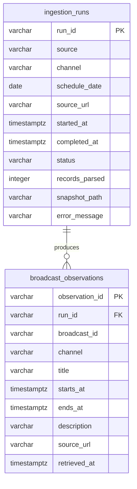
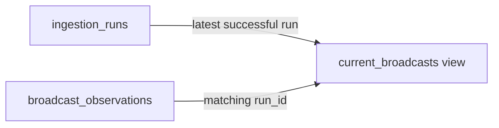
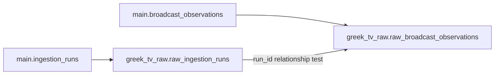
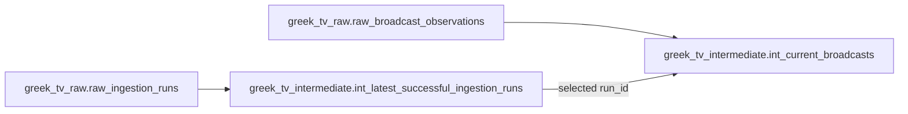

# Data model

This diagram documents the current DuckDB ingestion model. It is intentionally
small: ingestion attempts are stored separately from the schedule rows observed by
each attempt.

## Relationship

One row in `ingestion_runs` represents one ingestion attempt for a source, channel,
and requested schedule date. A successful run can produce many rows in
`broadcast_observations`; a failed or still-running attempt can have none.

The database enforces the relationship through
`broadcast_observations.run_id -> ingestion_runs.run_id`.

## Consumer view

`current_broadcasts` is a view rather than a physical table. It selects observations
from the latest successful run for each source, channel, and schedule date:

The view deliberately excludes failed attempts and older successful observations,
while the underlying tables retain the complete ingestion history.

## dbt source boundary

The repository-local dbt project declares `ingestion_runs` and
`broadcast_observations` as documented sources in DuckDB's `main` schema. No derived
dbt models exist in this foundation delivery, so the physical ERD above remains
unchanged. Staging and analytical relations will be added without mutating these
ingestion-owned tables.

The first derived layer adds two views without changing the source relationships:

Both views preserve their source grain. dbt tests enforce unique primary identifiers,
the run-to-observation relationship, required attributes, valid run statuses, and
basic numerical and temporal expectations.

## Intermediate current-state lineage

`int_latest_successful_ingestion_runs` has one row per source, channel, and schedule
date. `int_current_broadcasts` retains only observations belonging to those runs. The
derived result is semantically equivalent to the ingestion-owned `current_broadcasts`
view while exposing additional source, schedule-date, observation, and completion
metadata for downstream models.

## Legacy table

Databases created before the append-only model may also contain `broadcasts`. That
table is preserved for audit compatibility and migrated non-destructively into the
current model. It is not connected by a foreign key and is not part of the active
write path.
